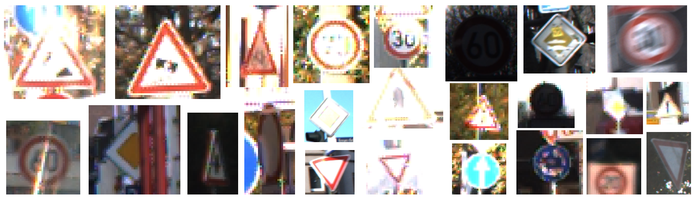
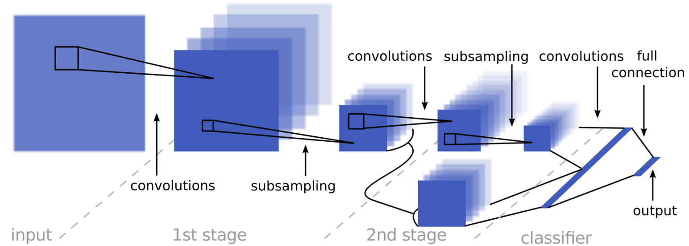
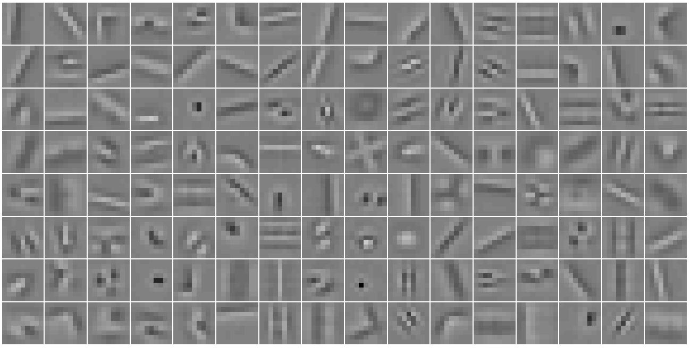
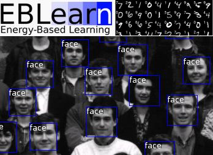
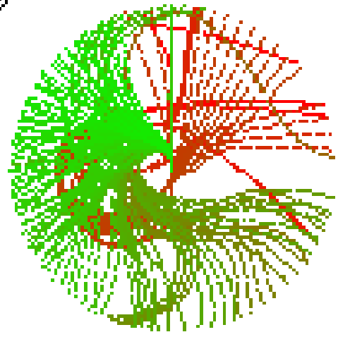
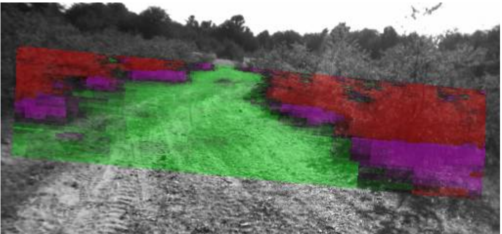
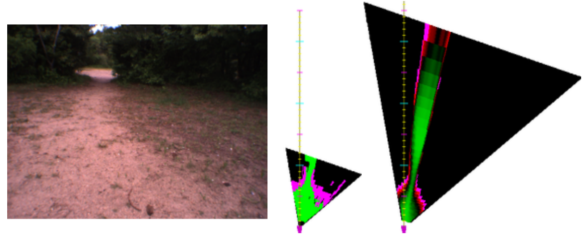

**Research Scientist** in Deep Learning, Computer Vision, Robotics, Self-Supervised Learning @ **Google Brain** 
[[LinkedIn]](https://www.linkedin.com/in/sermanet/) [[Scholar]](https://scholar.google.com/citations?user=0nPi5YYAAAAJ) [[YouTube]](https://www.youtube.com/user/nyulagr) [[Twitter]](https://twitter.com/psermanet) [[Email: first dot last at gmail]]()

| Projects |  |
| ------------- | ------------- |
|   | **Time-Contrastive Networks (TCN)** [[Project Page]](https://sermanet.github.io/imitate/) [[ Paper ]](https://arxiv.org/abs/1704.06888) [[BibTex]](http://dblp.uni-trier.de/rec/bibtex/journals/corr/SermanetLHL17) [[ Video ]](https://www.youtube.com/watch?v=b1UTUQpxPSY) [[ Dataset ]](https://sites.google.com/site/brainrobotdata/home/multiview-pouring) [[Code]]()  |
|   |  **Unsupervised Perceptual Rewards** [[Project Page]](https://sermanet.github.io/rewards/) [[ Paper ]](https://arxiv.org/abs/1612.06699) [[BibTex]](https://github.com/sermanet/home/blob/master/docs/bib/Sermanet2017Rewards.bib) [[ Video ]](https://youtu.be/7f7sdLMCItg) [[ Dataset ]](https://sites.google.com/site/brainrobotdata/home/pouring-dataset) |
|   |  **Self-Supervised Imitation Learning** [[Project Page]](https://sermanet.github.io/imitation/) |
|   | **Visual Attention** [[Paper]](https://arxiv.org/abs/1412.7054) [[BibTex]](https://github.com/sermanet/home/blob/master/docs/bib/Sermanet2015Attention.bib)|
|   | **Inception / GoogLeNet** [[Code]](https://github.com/tensorflow/models/tree/master/research/inception) [[Paper]](https://www.cv-foundation.org/openaccess/content_cvpr_2015/papers/Szegedy_Going_Deeper_With_2015_CVPR_paper.pdf) [[BibTex]](https://github.com/sermanet/home/blob/master/docs/bib/Szegedy2015Inception.bib) [[ImageNet Challenge]](http://www.image-net.org/challenges/LSVRC/2014/results)|
|   |  **Dogs vs. Cats Kaggle challenge** [[Leaderboard]](https://www.kaggle.com/c/dogs-vs-cats/leaderboard)  |
|   | **OverFeat** [[Code]](https://github.com/sermanet/OverFeat) [[Paper]](https://arxiv.org/abs/1312.6229) [[BibTex]](https://github.com/sermanet/home/blob/master/docs/bib/Sermanet2014OverFeat.bib) [[Slides]](http://www.image-net.org/challenges/LSVRC/2013/slides/overfeat_ilsvrc2013.pdf) [[ImageNet Challenge]](http://www.image-net.org/challenges/LSVRC/2013/results.php) [[Press]](https://machinelearning.apple.com/2017/11/16/face-detection.html)|
|   | **Pedestrian Detection** [[Video]](https://www.youtube.com/watch?v=uKU2pzpGUlM) [[Paper]](https://www.cv-foundation.org/openaccess/content_cvpr_2013/html/Sermanet_Pedestrian_Detection_with_2013_CVPR_paper.html) [[BibTex]](https://github.com/sermanet/home/blob/master/docs/bib/Sermanet2013Pedestrian.bib)|
|   | **Convolutional Neural Networks Applied to House Numbers Digit Classification** [[Paper]](https://arxiv.org/pdf/1204.3968.pdf) [[BibTex]](
https://github.com/sermanet/home/blob/master/docs/bib/Sermanet2012Convolutional.bib)|
|    | **Traffic Sign Recognition** [[Paper]](http://yann.lecun.com/exdb/publis/pdf/sermanet-ijcnn-11.pdf) [[BibTex]](https://github.com/sermanet/home/blob/master/docs/bib/Sermanet2011Traffic.bib) |
|   | **Unsupervised Convolutional Feature Hierarchies** [[Paper]](http://papers.nips.cc/paper/4133-learning-convolutional-feature-hierarchies-for-visual-recognition.pdf) [[BibTex]](https://github.com/sermanet/home/blob/master/docs/bib/Kavukcuoglu2010Unsupervised.bib)|
|   | **EBLearn** [[Code]](http://eblearn.sourceforge.net/) [[Paper]](http://yann.lecun.com/exdb/publis/pdf/sermanet-ictai-09.pdf) [[BibTex]](https://github.com/sermanet/home/blob/master/docs/bib/Sermanet2009EBLearn.bib) |
|   | **Teaching NYU Robotics class**  |
|   | **LAGR**  |
|   | **Learning Long-Range Vision for Autonomous Off-Road Driving** [[Paper]](http://www.cs.nyu.edu/~sermanet/lagr/papers/hadsell-jfr-09_wiley.pdf) [[BibTex]](https://github.com/sermanet/home/blob/master/docs/bib/Hadsell2009Learning.bib) |
|   | **Collision-Free Off-Road Robot Navigation** [[Paper]](https://cs.nyu.edu/~sermanet/lagr/papers/sermanet-jfr-09_wiley.pdf) [[BibTex]](https://github.com/sermanet/home/blob/master/docs/bib/Sermanet2009Multirange.bib) |
|   | **Learning Maneuver Dictionaries for Ground Robot Planning** [[Paper]](http://yann.lecun.com/exdb/publis/pdf/sermanet-isr-08.pdf) [[BibTex]](https://github.com/sermanet/home/blob/master/docs/bib/Sermanet2008Learning.bib) |
|   | **Mapping and Planning under Uncertainty in Mobile Robots with Long-Range Perception** [[Paper]](http://yann.lecun.com/exdb/publis/pdf/sermanet-iros-08.pdf) [[BibTex]](https://github.com/sermanet/home/blob/master/docs/bib/Sermanet2008Mapping.bib) |
|   | **Deep Belief Net Learning in a Long-Range Vision System** [[Paper]](https://cs.nyu.edu/~naz/docs/iros08.pdf) [[BibTex]](https://github.com/sermanet/home/blob/master/docs/bib/Hadsell2008Deep.bib) |
|   | **Online Learning for Offroad Robots** [[Paper]](http://yann.lecun.com/exdb/publis/pdf/hadsell-rss-07.pdf) [[BibTex]](https://github.com/sermanet/home/blob/master/docs/bib/Hadsell2007Online.bib) |
|   | **EUROBOT**  |
